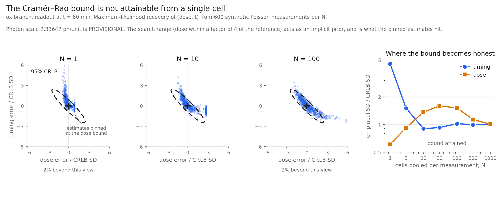

# Is the Cramér–Rao bound attainable? A validation of the Fisher analysis

A CRLB is a theorem about estimators, not a measurement. It says no unbiased
estimator beats `F⁻¹`; it does not say any estimator achieves it. Quoting
`F⁻¹` as "the decoder's precision" is therefore a claim that has to be
earned, and a wrong FIM would produce a confident, plausible, wrong number
that nothing in the analysis itself could catch.

`scripts/crlb_attainment.py` earns it, or finds that it cannot be earned, by
the standard route: simulate synthetic measurements from the model at a known
`(dose, t)`, recover `(dose, t)` by maximum likelihood, repeat, and compare
the empirical covariance of the estimates against `F⁻¹`.

## How the test is made valid

**The bound and the estimator share one λ(dose, t).** The estimator needs λ
at arbitrary `(dose, t)`, which means an interpolant over a grid of
simulations. If the FIM came from the ODE solver's gradients while the
estimator used the interpolant, interpolation error would appear as
non-attainment — we would be measuring our own grid spacing and calling it a
property of the device. Both therefore come from the same interpolant, and
the interpolant-derived FIM is cross-checked against `fisher_info_v3_1`'s
independently computed FIM before the experiment runs. The script aborts
rather than report a ratio if they disagree by more than 5%.

They agree to **0.64%**:

| | module (ODE gradients) | surface (interpolant) | rel. diff |
|---|---|---|---|
| F[ln d, ln d] | 2.812041 | 2.830002 | 6.4 × 10⁻³ |
| F[ln d, t] | 0.1333658 | 0.1333926 | 2.0 × 10⁻⁴ |
| F[t, t] | 7.315921 × 10⁻³ | 7.282850 × 10⁻³ | 4.5 × 10⁻³ |

That agreement is itself a check on the FIM implementation: two independent
differentiation routes, 0.64% apart.

**The operating point is the one we recommend, not the one that flatters.**
t = 60 min, at the reference dose. This is the readout time the project
actually recommends to the wet lab; testing at the CRLB's own optimum would
be self-serving.

## Result

Channel means at the operating point: 40.70 photons green, 18.54 red, per
cell. CRLB at N = 1: SD(ln dose) = 1.608 (161% relative), SD(t) = 31.7 min,
corr = −0.929.

600 synthetic measurements per N, seed 20261002.

| N | SD(t) emp | SD(t) CRLB | ratio | SD(ln d) emp | SD(ln d) CRLB | ratio | bias t (min) | corr emp | pinned |
|---|---|---|---|---|---|---|---|---|---|
| 1 | 145.04 | 31.70 | **4.58** | 0.978 | 1.608 | 0.61 | **+29.83** | −0.327 | 42% |
| 3 | 27.47 | 18.30 | 1.50 | 0.855 | 0.928 | 0.92 | +6.08 | −0.495 | 36% |
| 10 | 9.02 | 10.02 | **0.90** | 0.693 | 0.508 | 1.36 | +1.26 | −0.775 | 24% |
| 30 | 5.36 | 5.79 | 0.93 | 0.466 | 0.294 | 1.59 | +0.61 | −0.798 | 8% |
| 100 | 3.23 | 3.17 | 1.02 | 0.243 | 0.161 | 1.51 | +0.08 | −0.835 | 1% |
| 300 | 1.82 | 1.83 | 0.99 | 0.105 | 0.093 | 1.13 | −0.21 | −0.905 | 0% |
| 1000 | 1.00 | 1.00 | **1.00** | 0.051 | 0.051 | **1.00** | −0.01 | −0.923 | 0% |



### What it says

**The bound is not attainable from a single cell.** At N = 1 the real timing
error is 4.6× the bound, and the estimator is biased by +29.8 min on a true
value of 60 min — a 50% bias. The CRLB assumes an unbiased estimator, so at
N = 1 it does not merely overstate the precision; it does not apply.

**Timing reaches the bound at about N = 10.** From there the ratio sits
within 10% of 1 and the bias is under 1.3 min.

**Dose takes far longer — N ≈ 300 to 1000.** The dose ratio is
non-monotonic: below 1 at N = 1 (a biased, boundary-pinned estimator has
*compressed* scatter, which is why beating the bound is a symptom rather than
an achievement), overshooting to ~1.6 around N = 30–100, and converging to
1.00 only by N = 1000. This asymmetry is the decision-relevant output: a
protocol aimed at timing needs an order of magnitude fewer cells than one
aimed at dose.

**Four independent signatures agree** that the asymptotic regime starts where
the table says it does: the SD ratio approaches 1, the bias decays to zero,
the fraction of boundary-pinned estimates falls to zero, and the empirical
correlation converges to the CRLB's own (−0.923 against −0.929). Any one of
these could be coincidence; together they corroborate the FIM.

### What the pinned estimates mean

The vertical line of points in the scatter panels is not a plotting artifact.
It is estimates that ran into the upper dose bound of the search range, which
is set to a factor of 4 around the reference dose. That range acts as an
**implicit prior** — a real decoder also knows roughly what dose range is
physiological — and it is doing real work in the N = 1 result. A wider range
would reduce the pile-up and widen the scatter. The range is stated here
rather than buried because the N = 1 numbers are not interpretable without
it.

## Consequences for what we may claim

1. **No σ_t from this analysis may be quoted as a single-cell figure.** The
   bound describes a population measurement, and only above roughly 10 pooled
   cells for timing.
2. **Dose and timing claims need different cell counts.** Quoting one N for
   both would be wrong in one direction or the other.
3. **This validates the shot-noise bound only.** Real cells also differ from
   one another, which adds a variance floor that does not average away with
   N. That floor can only make the true bound worse than reported here, and
   it is the ablation study's shared-error term — still unmeasured.
4. **The absolute photon scale is still a placeholder.** `PHOTONS_PER_UNIT`
   sets λ, and the attainment threshold in N depends on λ: brighter cells
   would reach the asymptotic regime at smaller N. The N values above are
   therefore conditional on the photon budget, exactly as the σ values are.
   The Photon Transfer Curve fixes both at once.

## Reproducing

```bash
export PYTHONPATH=/path/to/Ichnos_PULSE/python:/path/to/Ichnos_PULSE/python/sensitivity_analysis/sensitivity
python scripts/crlb_attainment.py     # ~2 min, writes results/crlb_attainment.npy
python scripts/plot_attainment.py     # reads that file, writes the figure
```

The figure reads the saved run rather than recomputing, so it cannot show a
different experiment than the table.
